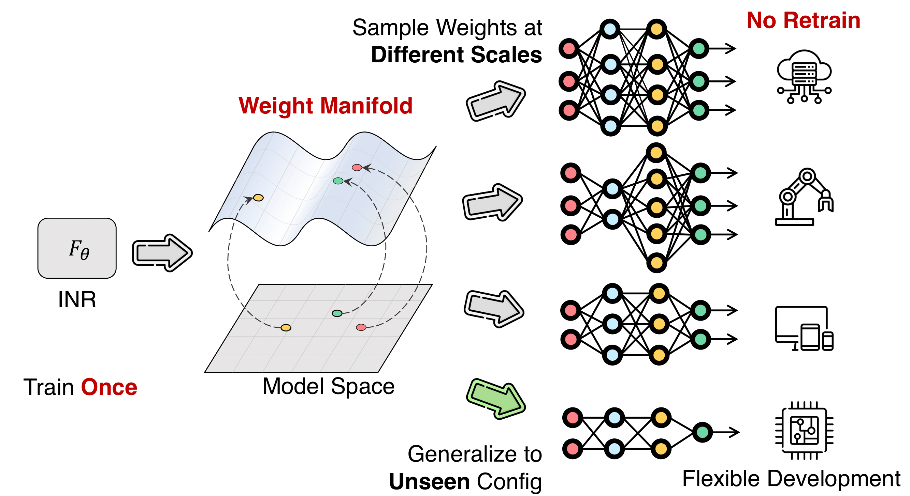

# 🦋 NeuMeta: Neural Metamorphosis 🦋

NeuMeta transforms neural networks by allowing a single model to adapt on the fly to different sizes, generating the right weights when needed. It streamlines performance and efficiency, eliminating the need for multiple models and adjusting seamlessly in real-time.


**Neural Metamorphosis**

 📝[[Paper](https://arxiv.org/abs/2409.10594)] </>[[code](https://github.com/Adamdad/neumeta)] 

Xingyi Yang, Xinchao Wang

National University of Singapore




## 🔧 Key Features
- **Dynamic Model Morphing**: Generate network weights on demand.
- **Weight Smoothness**: Ensures smooth transitions between weight configurations.

## 🏗️ Code Structure

```shell
neumeta/
│
├── config/        # Configuration files for experimental setups
├── models/        # Definitions and variations of NeuMeta models
├── prune/         # Scripts for model pruning and optimization
├── segmentation/  # Implementations for semantic segmentation tasks
├── similarity/    # Tools for evaluating model weight similarities
├── utils/         # General utility scripts
├── vae/           # Variational Autoencoder components for NeuMeta
│
├── training_scripts/   # Scripts for dataset-specific training
│   └── train_<DATASET>.py
│
├── hypermodel.py   # The INR Hypernetwork for NeuMeta
├── smoothness/     # Enforces smooth weight transitions across models
└── requirements.txt   # Dependency list

```

## 🚀 Getting Started
To run the NeuMeta project:

1. **Clone the repository**.
2. **Install the dependencies**: `pip install -r requirements.txt`.
3. **Prepare the preatrined checkpoint**: Ensure you have a pretrained model checkpoint for initialization. This will act as the base for Neural Metamorphosis.

4. **Convert to smooth weight**: Use the weight permutation algorithm in `smooth/permute.py` to transform the checkpoint into a smoother weight version for effective morphing. Here's an 
```python
from smooth.permute import PermutationManager

# Create the model for CIFAR10
model = create_model_cifar10(model_name)
model.eval()  # Set to evaluation mode

# Compute the total variation loss for the network
total_tv = compute_tv_loss_for_network(model, lambda_tv=1.0)
print("Total Total Variation After Training:", total_tv)

# Apply permutations to the model's layers and check the total variation
input_tensor = torch.randn(1, 3, 32, 32).to(device)
permute_func = PermutationManager(model, input_tensor)
# Compute the permutation matrix for each clique graph, save as a dict
permute_dict = permute_func.compute_permute_dict()
# Apply permutation to the weight
model = permute_func.apply_permutations(permute_dict, ignored_keys=[])
total_tv = compute_tv_loss_for_network(model, lambda_tv=1.0)
print("Total Total Variation After Permute:", total_tv)
```
  
5. **Train the INR on the checkpoint and dataset**
   - For example, if we want to run experiments on CIFAR10 with resnet20:
  ```shell
  PYTHONOPATH="$PWD" python neumeta/train_cifar10.py --config <CONFIG_PATH>
  ```

Replace `<CONFIG_PATH>` with the path to your specific configuration file tailored for the dataset and model architecture you intend to train.

6. **Weight Sampling for Target Model**
After training the INR, sample weights for any architecture in the same family. For example:
```python
#### Load INR model ####
hyper_model = <XXXX>

for hidden_dim in range(16, 65):
    # Create a model for the given hidden dimension
    model = create_model(args.model.type, 
                          hidden_dim=hidden_dim, 
                          path=args.model.pretrained_path, 
                          smooth=args.model.smooth).to(device)
        
    # Sample the merged model for K times
    accumulated_model = sample_merge_model(hyper_model, model, args, K=100)

    # Validate the merged model
    val_loss, acc = validate_single(accumulated_model, val_loader, val_criterion, args=args)

    # Print the results
    print(f"Test using model {args.model}: hidden_dim {hidden_dim}, Validation Loss: {val_loss:.4f}, Validation Accuracy: {acc*100:.2f}%")        
```

## 📚 Bibtex
If you use this repository, please cite:
```bibtex
@misc{yang2024neumeta,
    title={Kolmogorov–Arnold Transformer},
    author={Xingyi Yang and Xinchao Wang},
    year={2024},
    journal={ECCV},
}
```